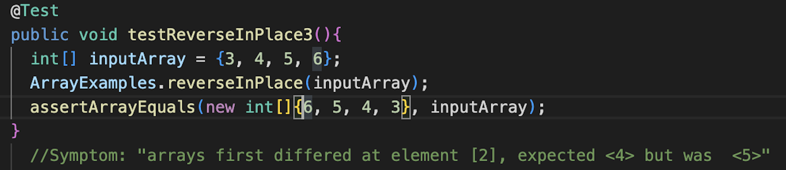

# Lab Report 2

Sarah Burbach

## Part 1

**Search Engine Code:**
```
import java.io.IOException;
import java.net.URI;
import java.util.ArrayList;

class Handler implements URLHandler {

    int num = 0;
    
    ArrayList<String> list = new ArrayList<String>();

    public String handleRequest(URI url) { 
        // Return contents of arraylist
        if (url.getPath().equals("/")) {  
            String toPrint = "";
            for(String l:list){toPrint += "'"+ l + "' ";}
            return ("Here is your current list:" + toPrint);
        } 
        
        // Add string to arraylist
        else if (url.getPath().contains("/add")) {
            String[] parameters = url.getQuery().split("=");
            if (parameters[0].equals("s")) {
                list.add(parameters[1]);
                
                String toPrint = "";
                for(String l:list){toPrint += "'"+ l + "' ";}
                return "String successfully added! Here is your current list: " + toPrint;
            }
            else{
                return "Error!";
            }
        } 

        // Query list and return list of strings that contain the given substring
        else if (url.getPath().contains("/search")) {
            String[] parameters = url.getQuery().split("=");
            if (parameters[0].equals("s")) {
                String queryToPrint = "";
                for(String l:list){
                    if (l.contains(parameters[1])){
                        queryToPrint += "'"+ l + "' ";
                    }
                }

                return "Here are the strings that match your query: " + queryToPrint;
            }
            else{
                return "Error!";
            }
        } 
        else {
            return "Error!";
        }
    }
}

class SearchEngine {
    public static void main(String[] args) throws IOException {
        if(args.length == 0){
            System.out.println("Missing port number! Try any number between 1024 to 49151");
            return;
        }

        int port = Integer.parseInt(args[0]);

        Server.start(port, new Handler());
    }
}
```

**Screenshot 1: Add**

In this screenshot, the program is running through the first else if loop in the handleRequest method. This is initiated by the inputed url containing the string "/add" followed by a "?" to indicate a query.

The contents of this query are stored in the String[] parameters, divided into two parts by the "=" in the query. Therefore, the first element of the array is "s" (to indicate that the element to be inserted into the list is a string) and the second element of the array is the string to be added to the list. 

In this specific example, the string being added is "Hello!". Therefore, the contents of parameters was ["s", "Hello!"]. The second element of this array will be added to the list, then a success statement will be printed on the webpage using the toPrint string.


**Screenshot 2: After Adding**

This screenshot shows what is displayed on the webpage (after strings are added to the list) when you go to the domain of the website. 

When this occurs, the program is running through the first if statment in the handelRequest method. This if statement just uses the String toPrint to print all of the strings in the current list. 

In this specific example, I previous added 3 strings to the list, so it displays all three of those strings. 


**Screenshot 3: Search**

This screenshot shows the program running through the second else if loop in the handleRequest method. This else if loop is initiated by the input url containing the string "/search" followed by a "?" to indicate a query. 

Similar to the add method, the contents of this query are stored in the String[] parameters, divided into two parts by the "=" in the query. Therefore, in this example, the contents of parameters was ["s", "!"]. However, rather than the "!" being added to the list, the program runs a for loop that calls the contains method to check if the substring "!" is present in any of the strings on the list. 

Any strings that contain the "!" are added to the queryToPrint string, which is then displayed on the webpage. 


## Part 2

**Array Methods: ReverseInPlace Method**

*Failure-Inducing Input*


* The failure inducing input is a string array of 4 integers: {3, 4, 5, 6}.

*Symptom*


* The symptom is the test failing at the second element of the array becuase the reversed array should have contained the number 4 but instead contained 5. 

*Bug*


* The problem with this code is that the program isn't storing the values of the orginal array, so when it is updating the second half of the list it is using values that were already updated in earlier iterations of the loop. 
* To fix this, the program needs to make a copy of the orginal array before it begins updating the array, so it can reference the copy while updating. This would look like this:


* The added for-loop makes an exact copy of the inputed array and the code in the orginal for loop is changed to reference the new 'arrCopy' array rather than itself.

*Connection between the symptom and bug*

* This bug causes this symptom because the program isn't storing the contents of the original array. Once it reaches the halfway point of the array, it begins using values in the begining of the array that were already updated. This is why the index 2 of the array is found to be 5 (when it should be 4) -- at that point, the array was updated to {6, 5, 5, 6} so the program made index 2 (5) equal to index 1 (5).


**List Methods: Filter Method**

*Failure-Inducing Input*


* As shown in the photo above, the failure inducing input is a list of three strings {"thisisalongstring", "apple", "test}.

*Symptom*


* The symptom is order of the elements in the array being incorrect -- the method is supposed to add elements that pass the stringchecker to the new array in the same order that they were in the original array. 

*Bug*


* The bug causing this symptom is in the line "result.add(0,s)", which adds the new string to the first index of the list. This bug can be fixed by changing this line to read "result.add(s)", as shown below:


*Connection between the symptom and bug*

* This bug causes this symptom because the 0 in the first element of the add method tells the program to add the new string at the begining of the list (rather than at the end, as it should). This is why "test" is placed in the array before "apple", when it should have been the other way around.

