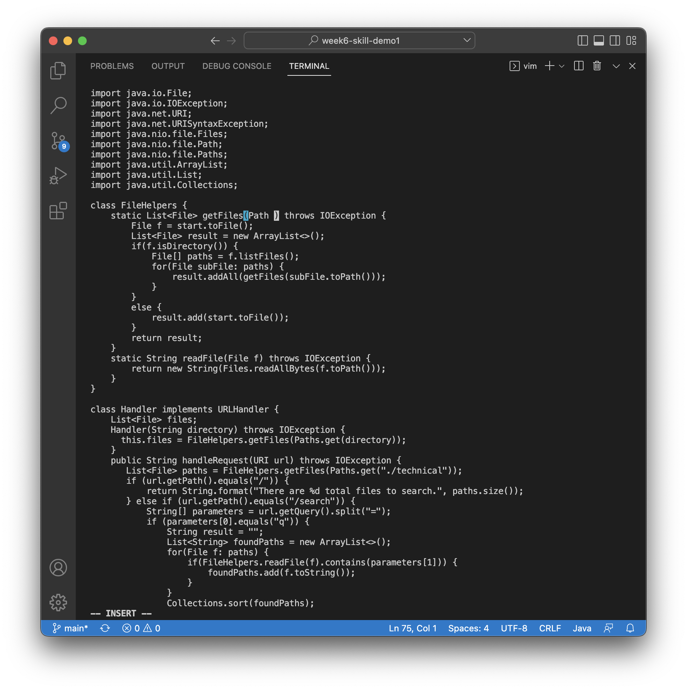
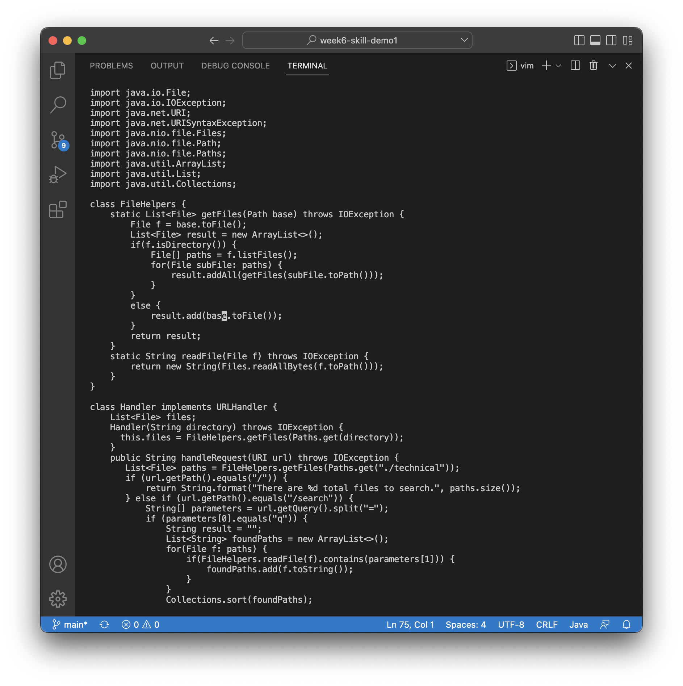
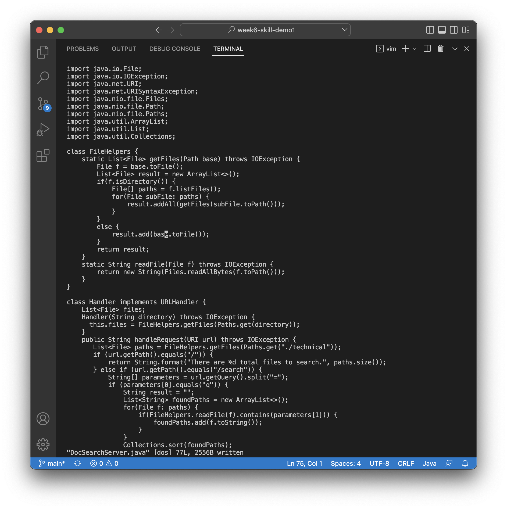

# Lab Report 4

Sarah Burbach

## Part 1

*Task: Changing the name of the start parameter and its uses to base*

The shortest sequence we came up with was:
`/start<enter>cebase<esc>n.n.:w<enter>`

**Screenshots for each step in the sequence**

Upon first opening vim, this is what the window looks like:

`/start<enter>`: searches for the term 'start' and moves cursor to the first instance of 'start' in the file

`ce`: enters insert mode and deletes the word 'start'

`base<esc>`: still in insert mode from the previous command, type the word 'base' then return to normal mode by pressing escape

`n.n.`: `n` finds the next instance of the search term and `.` repeats the previous action (in this case ce and base<esc>, to replace 'start' with 'base')

`:w<Enter>`: saves the changes to the file

## Part 2

**Editing using VScode took: 1 minute, 5 seconds**

* I made a few typos entering the scp/ssh commands, but other than that it was pretty seamless.
* One thing I thought about while doing this though is that it was easy for me to change all of the 'start' terms to 'base' quickly because I knew where in the file to look (from doing this multiple times perviously using vim), which made the process must faster than it would be if I wasn't as familiar with the file. 

**Editing using Vim took: 52 seconds**

* I did have any issues using vim to edit this file, but that could be becuase I just praticed doing it with vim in the last section of the report so I already knew exactly what to do and what it should look like. 

**Questions:**

*Which of these two styles would you prefer using if you had to work on a program that you were running remotely, and why?*
* I think that for most situations I would usually prefer to use VScode, becuase I am more familiar with the interface. In this specific situation using vim was faster (and I can certainly think of other situations where it could be faster), but I think it was faster only becuase I already had all of the steps pre-written and just had to follow them. I don't think that, in a different situation, I would be able to come up with the correct vim commands to do what I need to do quickly.
* If I got more practice using the vim commands though, I think I could see myself using vim in some situations becuase it defenitely has advantanges for editing files remotely. 

*What about the project or task might factor into your decision one way or another?*
* I found the find and replace function of vim very helpful, so I could see myself using vim for situtations like this where you want to change a lot of a single variable or need to repeat the same command multiple times. 
* Also, if it was a directory or large set of files that I didn't have on my local device (aka, is only on the remote server), then I would defintely use vim to edit it. 

