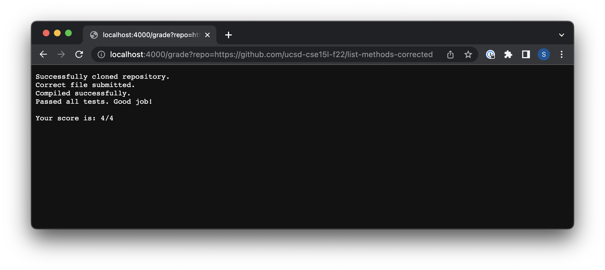
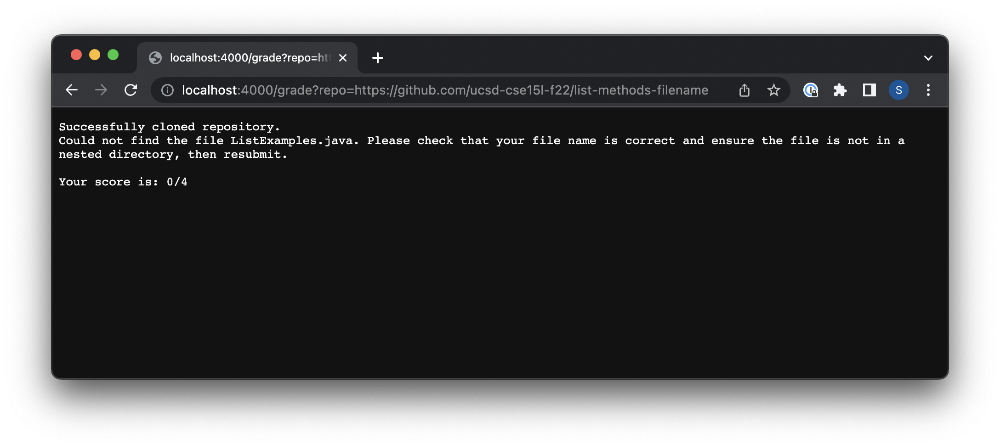
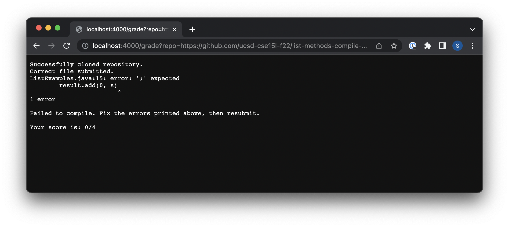

# Lab Report 5

Sarah Burbach

**My 'Grade.sh' file**
```
# Clone repository
rm -rf student-submission
git clone --quiet $1 student-submission
if [[ $? -eq 0 ]]
then
    echo "Successfully cloned repository."
else
    echo "Failed to clone respository. Make sure the respository link is correct."
    echo ""
    echo "Your score is: 0/4"
    exit
fi

# Copy tests to student repository
cp TestListExamples.java student-submission/
cp -r lib student-submission/

# Move into student submission directory
cd student-submission

# Check if student code has the correct file submitted
if [[ -e ListExamples.java ]]
then
    echo "Correct file submitted."
else
    echo "Could not find the file ListExamples.java. Please check that your file name is correct and ensure the file is not in a nested directory, then resubmit."
    echo ""
    echo "Your score is: 0/4"
    exit
fi

# Compile student code and tests - if compilation fails, give feedback about it
javac -cp .:lib/hamcrest-core-1.3.jar:lib/junit-4.13.2.jar *.java
if [[ $? -eq 0 ]]
then
    echo "Compiled successfully."
else
    echo ""
    echo "Failed to compile. Fix the errors printed above, then resubmit."
    echo ""
    echo "Your score is: 0/4"
    exit
fi

# Run tests and report grade based on test outputs
java -cp .:lib/hamcrest-core-1.3.jar:lib/junit-4.13.2.jar org.junit.runner.JUnitCore TestListExamples > TestResults.txt
grep "Failures:" TestResults.txt > TestResultsLine.txt
if [[ -s TestResultsLine.txt ]]
then
    cat TestResultsLine.txt
    awk '{print $5}' TestResultsLine.txt > Score.txt
    variable=$(expr 4 - $(cat Score.txt))
    echo ""
    echo "Your score is: $variable/4"
    exit
else
    echo "Passed all tests. Good job!"
    echo ""
    echo "Your score is: 4/4"
    exit
fi
```

**Screenshots of Student Submissions**








**Trace of last student submission above** (compile error submission)

`rm -rf student-submission` 
* This command has no standard output or standard error. Its exit code is zero. 

`git clone --quiet $1 student-submission`
* This command has no standard output or standard error. Its exit code is zero. 

`if [[ $? -eq 0 ]]`
* The condition was True, becuase the repository is successfully cloned therefore the exit code was 0 for the previous command (as described above).

`echo "Successfully cloned repository."`
* This line runs, becuase it was in the 'then' condition of the if statement above.
* The commands standard output is "Successfully cloned repository.". It has no standard error and its exit code is zero. 

```
echo "Failed to clone respository. Make sure the respository link is correct."
echo ""
echo "Your score is: 0/4"
exit
```
* All four of the lines above do not run, becuase they are in the 'else' section of the if statement that returned true. 

`cp TestListExamples.java student-submission/`
* This command has no standard output or standard error. Its exit code is zero. 

`cp -r lib student-submission/`
* This command has no standard output or standard error. Its exit code is zero. 

`cd student-submission`
* This command has no standard output or standard error. Its exit code is zero. 

`if [[ -e ListExamples.java ]]`
* This condition is True, becuase the repository correctly contains the file "ListExamples.java". 

`echo "Correct file submitted."`
* This line runs, becuase it is in the 'then' condition of the if statement above.
* This commands standard output is "Correct file submitted.". It has no standard error and its exit code is zero. 

```
echo "Could not find the file ListExamples.java. Please check that your file name is correct and ensure the file is not in a nested directory, then resubmit."
echo ""
echo "Your score is: 0/4"
exit
```
* All four of the lines above do not run, becuase they are in the 'else' section of the if statement that returned true. 

`javac -cp .:lib/hamcrest-core-1.3.jar:lib/junit-4.13.2.jar *.java`
* This command has no standard output. However, the standard error is: 
        ListExamples.java:15: error: ';' expected
                result.add(0, s)
                                ^
        1 error
* The standard error occurs becuase the ListExamples.java file is missing a semicolon. This error causes the command to produce a non-zero exit code.

`if [[ $? -eq 0 ]]`
* This condition is false, becuase the previous line produces an error since the line before it (javac) produces a non-zero exit code. 

`echo "Compiled successfully."`
* This line does not run, becuase it is in the 'then' condition of the if statement above. 

`echo ""`
* This commands standard output is "". It has no standard error and its exit code is zero. 

`echo "Failed to compile. Fix the errors printed above, then resubmit."`
* This commands standard output is "Failed to compile. Fix the errors printed above, then resubmit.". It has no standard error and its exit code is zero. 

`echo ""`
* This commands standard output is "". It has no standard error and its exit code is zero. 

`echo "Your score is: 0/4"`
* This commands standard output is "Your score is: 0/4". It has no standard error and its exit code is zero. 

`exit`
* This command has no standard output or standard error. Its exit code is zero. 

All of the lines below do not run, becuase they follow the exit code that was run above:

```
# Run tests and report grade based on test outputs
java -cp .:lib/hamcrest-core-1.3.jar:lib/junit-4.13.2.jar org.junit.runner.JUnitCore TestListExamples > TestResults.txt
grep "Failures:" TestResults.txt > TestResultsLine.txt
if [[ -s TestResultsLine.txt ]]
then
    cat TestResultsLine.txt
    awk '{print $5}' TestResultsLine.txt > Score.txt
    variable=$(expr 4 - $(cat Score.txt))
    echo ""
    echo "Your score is: $variable/4"
    exit
else
    echo "Passed all tests. Good job!"
    echo ""
    echo "Your score is: 4/4"
    exit
fi
```
